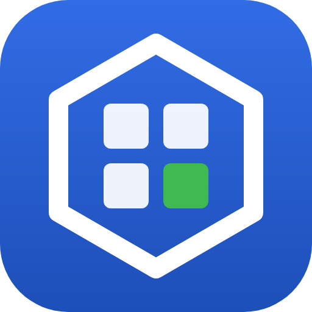

<p align="center"></p>

# k8sBoard

k8sBoard is a native desktop app for administering Kubernetes clusters, written in Rust with GPUI Kit. It is read-only by default: every change goes through one guarded write path with a permission check, a server-side dry run, a confirmation, and an audit log.

## Status

Early. Windows is the first supported platform. The source also has Linux and macOS code paths, but those builds are not released yet and Linux has never been built.

## Features

- Cluster overview with needs-attention issues, capacity bars, and a node heatmap; an Issues screen; a topology graph of related objects, with PNG export.
- Live tables with side drawers (Overview, YAML, Events) for pods, nodes, and workload, network, config, storage, policy, and access-control kinds.
- Helm releases (values and notes masked until revealed) and custom resources, discovered from the cluster's CRDs.
- RBAC and policy analysis; Secret values hidden by default and cleared from the clipboard after 30 seconds.
- Pod logs with a filter and a workload-wide view, a pod shell, node shell and debug containers, and port-forwarding with a Port Forwarding page.
- Monitor charts from metrics-server, the kubelet, or a Prometheus-compatible source.
- Edits: YAML with a diff, dry run, conflict handling, and revision history; ConfigMap and Secret values; new objects from templates.
- Actions: scale, restart rollout, pause and resume, roll back, CronJob suspend and trigger, cordon, uncordon, and drain, and delete.
- Guardrails: per-cluster lock, server-side dry run, typed confirmation in production, and an append-only audit log.
- A command palette, a keyboard map, namespace comparison, and object navigation (back, links, relations).
- Settings: clusters, environments (with custom ones), appearance (theme, row density, font size, bundled Lilex font), keyboard shortcuts, safety, terminal and shell, logs.

## Requirements

- Windows 10 or 11.
- A kubeconfig for the cluster you want to manage.
- Rust 1.96 to build from source (`rust-toolchain.toml` pins it).

## Build and run

```bash
cargo build --release -p k8sboard
target/release/k8sboard --kubeconfig <file> --context <name>
```

Both flags are optional: the default is the first `KUBECONFIG` entry, else `~/.kube/config`, and the kubeconfig's current context. `k8sboard --help` lists the other options.

Contexts named `kind-*` are classified as local. A disposable kind cluster for trying the write paths is described in [tools/kind/README.md](tools/kind/README.md).

## Configuration

Settings live in the OS config folder (`%APPDATA%\k8sBoard` on Windows) in release builds and in `.tmp/config` inside the workspace in debug builds. The `K8SBOARD_CONFIG_DIR` variable or the `--config-dir` flag overrides it. Settings hold paths and context names only, never tokens or key data. See `crates/app/src/settings_store.rs`.

## Development

Quality gate:

```bash
cargo fmt --all -- --check
cargo clippy --workspace --all-targets -- -D warnings
cargo test --workspace
```

- `docs/specs/NNNN-*` holds one folder per feature spec.
- `docs/roadmap/` holds the feature inventory and gap plans.
- `docs/agents/` holds the agent workflow and code style.
- `docs/k8sboard-wireframes.html` holds the wireframes.
- `crates/cluster` is the Kubernetes access library; `crates/app` is the GPUI application.

## Releases

Pushing a `vX.Y.Z` tag builds the release archives and drafts a GitHub release. See [docs/release.md](docs/release.md).

## License

Apache-2.0, see [LICENSE](LICENSE). The bundled Lilex fonts are under the SIL Open Font License 1.1, see [crates/app/fonts/OFL.txt](crates/app/fonts/OFL.txt).
